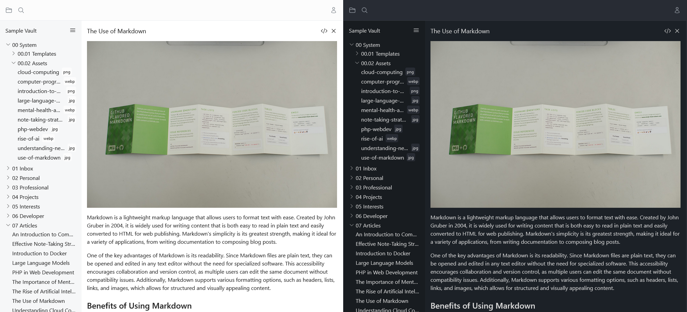

# Many Notes

Many Notes is a markdown note-taking app designed for simplicity! Easily create or import your vaults and organize your thoughts right away.



## Features

- Multiple users
- Multiple vaults per user
- File search
- Tree view explorer for quick navigation
- Import/export vaults
- Light/dark theme (automatically selected by your OS setting)
- Mobile friendly

## Installation guide (Docker)

Create a new directory named "many-notes" with this structure:

```
mariadb/
	data/
	initdb/
compose.yaml
```

Edit compose.yaml and paste:

```yaml
services:
  php:
    image: brufdev/many-notes:latest
    restart: unless-stopped
    environment:
      - PHP_OPCACHE_ENABLE=1
      - PHP_POST_MAX_SIZE=500M
      - PHP_UPLOAD_MAX_FILE_SIZE=500M
      - AUTORUN_ENABLED=true
      - APP_TIMEZONE=UTC
      - APP_URL=http://localhost # change url
      - ASSET_URL=http://localhost # change url
      - DB_CONNECTION=mariadb
      - DB_HOST=many-notes-mariadb-1
      - DB_PORT=3306
      - DB_DATABASE=manynotes
      - DB_USERNAME=user
      - DB_PASSWORD=USER_PASSWORD # change password
# Uncomment these lines if you want to configure an email service
#     - MAIL_MAILER=smtp
#     - MAIL_HOST=127.0.0.1
#     - MAIL_PORT=2525
#     - MAIL_USERNAME=null
#     - MAIL_PASSWORD=null
#     - MAIL_ENCRYPTION=null
#     - MAIL_FROM_ADDRESS=hello@example.com
#     - MAIL_FROM_NAME=${APP_NAME}
    volumes:
      - storage-public:/var/www/html/storage/app/public
      - storage-private:/var/www/html/storage/app/private
      - storage-sessions:/var/www/html/storage/framework/sessions
      - storage-logs:/var/www/html/storage/logs
    networks:
      - www
    ports:
      - 80:8080
  mariadb:
    image: mariadb:11.5
    restart: unless-stopped
    environment:
      - MARIADB_ROOT_PASSWORD=ROOT_PASSWORD # change password
      - MARIADB_DATABASE=manynotes
      - MARIADB_USER=user
      - MARIADB_PASSWORD=USER_PASSWORD # change password
    volumes:
      - ./mariadb/data:/var/lib/mysql
      - ./mariadb/initdb:/docker-entrypoint-initdb.d
    networks:
      - www

networks:
  www:
    external: true

volumes:
  storage-public:
  storage-private:
  storage-sessions:
  storage-logs:
```

Make sure to change urls and passwords and feel free to customize anything else if you know what you're doing. Then run:

```shell
docker network create www
docker compose up -d
```

## Troubleshooting

- Edit PHP_POST_MAX_SIZE and PHP_UPLOAD_MAX_FILE_SIZE if you're getting errors while importing big vaults  

## License

This project is licensed under the MIT License. See the [LICENSE](LICENSE) file for the full license text.
